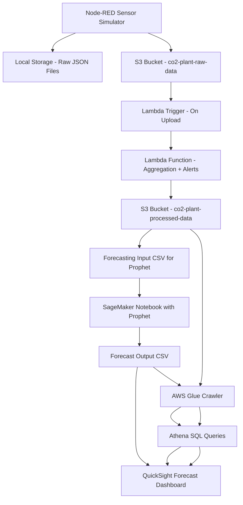

# 🌿 GCT Case Study – CO₂ Plant Data Pipeline 

## 👋 Introduction

This project is part of the GCT Case Study Challenge, where I’ve built a fully functional data pipeline that simulates a CO₂ capturing plant's sensor system. My goal was to ingest real-time data, structure it in the cloud, and automatically process it — using only AWS free-tier tools.

This README documents my process, tools, and how the system works end-to-end.

---

## 🧪 Project Summary

- **Sensor Simulation**: 8 virtual sensors generate data every 10 seconds.
- **Data Format**: NDJSON (each line = one reading).
- **Storage**: Every 1 minute, a file containing 6 readings is created.
- **Upload**: Each file is saved to both local disk and S3 using Node-RED.
- **Trigger**: AWS Lambda processes every new file uploaded to S3.
- **Output**: A summary file with stats and alerts is saved to a second S3 bucket.
- **Dashboard**: Data visualized using AWS Glue, Athena, and QuickSight.

---

## 🔧 Tools I Used

| Tool            | Why I Used It                         |
| --------------- | ------------------------------------- |
| **Node-RED**    | To generate and send JSON sensor data |
| **AWS S3**      | For cloud storage (raw + processed)   |
| **AWS Lambda**  | For automatic processing + alerting   |
| **AWS Glue**    | Crawling processed data               |
| **AWS Athena**  | Querying processed data               |
| **SageMaker**   | Forecasting with Prophet              |
| **QuickSight**  | Forecast dashboard (real-time)        |
| **Python 3.12** | Lambda runtime and scripting          |

---

## 📁 Folder Structure in S3

### Input: `co2-plant-raw-data`

```
raw/
  └── Year YYYY/
      └── Month MM/
          └── Day DD/
              └── HH/
                  └── sensor_HHMM.json
```

Each JSON file contains 6 lines like this:

```json
{"timestamp":"...","pH":"7.5",...,"co2":"410.0"}
```

---

### Output: `co2-plant-processed-data`

```
processed/
  └── sensor_HHMM_summary.json
```

Each summary file looks like this:

```json
{
  "source_file": "raw/Year.../sensor_0832.json",
  "summary": {
    "pH": {"mean": 7.2, "std_dev": 0.4},
    "temperature": {"mean": 25.3, "std_dev": 1.8}
  },
  "alert_flags": [
    "⚠️ ALERT: pH = 5.8 at 2025-07-12T08:13:40Z"
  ]
}
```

---

## ⚙️ Lambda: What It Does

Whenever a file is uploaded to `raw/` in S3:

1. **Reads** the file line by line.
2. **Parses** each reading.
3. **Calculates** mean and standard deviation for each sensor.
4. **Checks** if any value crosses alert thresholds.
5. **Saves** a summary file in `co2-plant-processed-data`.

Thresholds for alerts:

| Sensor        | Rule                  |
| ------------- | --------------------- |
| `pH`          | `< 6.0 or > 8.5`      |
| `temperature` | `< 5°C or > 40°C`     |
| `pressure`    | `< 1 bar or > 10 bar` |
| `co2`         | `< 300 or > 1000 ppm` |

---

## 🗃️ S3 Forecasting Folder Structure

### `co2-plant-raw-data`
```
raw/YYYY/MM/DD/HH/sensor_HHMM.json
```

### `co2-plant-processed-data`
```
processed/sensor_HHMM_summary.json
forecasting/
  ├— input/forecast_data.csv       ← used by SageMaker
  └— output/fill_level_forecast.csv ← generated by Prophet
```

---

## 🔮 Forecasting Pipeline (SageMaker + Prophet)

- Created a **Jupyter Notebook** in **SageMaker Studio**
- Used Prophet to train on `fill_level` time series
- Forecasted 24 future hourly values
- Saved forecast CSV back to:
  ```
  s3://co2-plant-processed-data/forecasting/output/fill_level_forecast.csv
  ```

### Sample output:
```csv
ds,yhat
2025-07-15 01:00:00,53.12
2025-07-15 02:00:00,51.87
...
```

---

## 📊 Real-Time Dashboard (Amazon QuickSight)

- Connected QuickSight to S3 bucket
- Created a dataset from forecast CSV
- Built a **line chart** using:
  - `ds` as time (x-axis)
  - `yhat` as forecast (y-axis)
- Enabled **hourly aggregation** and scheduled dataset refresh
- Updated visuals to avoid default SUM aggregation — now using **AVG or raw `yhat`** values per timestamp.
- Set X-axis to **hour-level granularity** for clearer forecasting trends.

### Dashboard Features:
- 24-hour fill level forecast
- Auto-updating via S3 refresh
- Drill-down by hour or custom filters
- Visuals cleaned for precision (fixed SUM/aggregation issues)

---

## ✅ IAM Permissions Note

To enable SageMaker → S3 access:

Attached the following IAM policy to SageMaker execution role:

```json
{
  "Effect": "Allow",
  "Action": ["s3:GetObject", "s3:PutObject", "s3:ListBucket"],
  "Resource": [
    "arn:aws:s3:::co2-plant-processed-data",
    "arn:aws:s3:::co2-plant-processed-data/*"
  ]
}
```

## 🧠 What I Learned

- Working with AWS Lambda triggers and permissions (IAM).
- Handling race conditions in S3 file availability.
- Structuring data in the cloud for long-term storage and scalability.
- Debugging tricky JSON issues with newline-delimited formats.
- Using Glue + Athena to power dashboard queries.
- Creating QuickSight visuals directly from Lambda output.

---

## 🚧 Future Plans

- Anomaly Detection (ML-Based)
- Time Series Forecasting
- Data Quality Checks
- Cost Optimization & Cold Storage

---

## 📂 Repository Structure 

```
📁 Documents/
  └── Case Study.pdf                             ← Node-RED flow export
📁 node-red/
  └── gct-flow.json                              ← Node-RED flow export
📁 lambda/
  └── lambda_function.py                         ← Processing script
📁 samples/
  └── sensor_sample.json                         ← Sample input file
📁 screenshots/
  └──📁 AWS/                                     ← AWS screenshots
      └── Dashboard.png                           ← Visual evidence (Node-RED UI, Glue, Athena, QuickSight)
  └── AWS.png                                     ← Sample Dashboard
📄 README.md                                     ← Readme File   
📄 Vijay_Presentation.pptx                       ← Case Study Presentation
```
---
## ⚙️ Architecture Overview


---
## 🤝 About Me

Hi! I’m Vijay. This case study was a great hands-on experience where I learned to think like a systems integrator — working with real-time data, serverless compute, and cloud architecture, all from the ground up.

If you’re reviewing this repo, feel free to reach out. Feedback is welcome!

Mail_id: vijaysdeutsch@gamil.com

